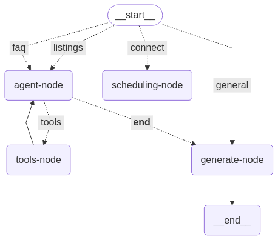

# EstateWise Voice Agent

EstateWise is an AI-powered real estate voice agent enabling users to interact via speech or text to:

- Retrieve property listings
- Answer FAQs about the company
- Connect users to a human agent for deal locking
- Schedule meetings using Google Calendar

---

## 🏗️ Architecture Overview

- **Frontend:** Streamlit app for voice/text input and results display
- **Backend:** FastAPI server for API endpoints and agent orchestration
- **Vector DBs:** FAISS-based semantic search for listings and FAQs
- **Google Calendar:** OAuth2 integration for scheduling
- **Speech:** Whisper (STT), ElevenLabs (TTS), pydub, ffmpeg



---

## ⚙️ Tech Stack & Main Dependencies

- Python >= 3.10
- Streamlit, FastAPI, Uvicorn
- FAISS, SentenceTransformers
- OpenAI, HuggingFace, Groq, NVIDIA APIs
- ElevenLabs, AssemblyAI (speech)
- Google API Client (calendar)
- pydub, ffmpeg (audio)

See `requirements.txt` for the full list.

---

## 📁 Project Structure

```
.
├── agent.py                        # LangGraph agent setup
├── app.py                          # Streamlit UI entry point
├── server.py                       # FastAPI backend server
├── datafiles/                      # JSON data for FAQs, T&Cs, recordings
│   └── recordings/                 # Audio files (input/output)
├── faq_retriever.py                # FAQ retrieval logic
├── listings_retriever.py           # Property listings retrieval
├── faq_vector_db/                  # FAISS index for FAQs
├── listings_vector_db/             # FAISS index for listings
├── pages/                          # Streamlit page files (speech/text input)
├── prompts/                        # Prompts for the LangGraph agent
├── scripts/                        # Data cleaning and vector DB creation scripts
├── utils/                          # Utility scripts: TTS, STT, embedding, etc.
├── view_calender/                  # Calendar viewing utilities
├── media/                          # Diagrams/images
├── requirements.txt                # Python dependencies
├── Dockerfile                      # Docker setup
├── .env                            # API keys and environment variables
└── README.md                       # Project documentation
```

---

## 🧩 Core Modules Explained

- **agent.py**: Sets up the LangGraph agent, orchestrates tool usage.
- **app.py**: Streamlit UI for user interaction (voice/text input, results display).
- **server.py**: FastAPI backend for API endpoints (agent, listings, FAQ, calendar).
- **faq_retriever.py / listings_retriever.py**: Query vector DBs for semantic search.
- **utils/**: Audio (TTS/STT), embedding, Google Calendar, and other helpers.
- **scripts/**: Data cleaning and vector DB creation utilities.

---

## 📚 Prerequisites

- Python >= 3.10
- FFmpeg installed (required by pydub)
- Git

---

## 🚀 Installation Guide

### 1. Clone the Repository

```bash
git clone https://github.com/your-username/estate-wise.git
cd estate-wise
```

### 2. Set Up Virtual Environment

```bash
python -m venv .venv
source .venv/bin/activate   # On Windows: .venv\Scripts\activate
```

### 3. Install Dependencies

```bash
pip install -r requirements.txt
```

### 4. Set Up Environment Variables

Create a `.env` file in the root directory and paste the following:

```ini
HUGGINGFACE_API_KEY=your_huggingface_key
GROQ_API_KEY=your_groq_key
NVIDIA_API_KEY=your_nvidia_key
INPUT_SOUND_FILES_PATH=datafiles/recordings/input/
OUTPUT_SOUND_FILES_PATH=datafiles/recordings/output/
ELEVENLABS_API_KEY=your_elevenlabs_key
ASSEMBLYAI_API_KEY=your_assemblyai_key
```

> ✉️ Replace `your_*_key` with your actual API keys.

### 5. Add Google Calendar Credentials

Place `credentials.json` (from Google Cloud) in the root directory.

---

## 🐳 Quickstart with Docker (Optional)

Build and run the app in a container:

```bash
docker build -t estatewise .
docker run -p 8501:8501 --env-file .env estatewise
```

---

## 🌐 Run the App

### Option 1: Streamlit Frontend

```bash
streamlit run app.py
```

Access at [http://localhost:8501](http://localhost:8501)

### Option 2: FastAPI Backend

```bash
uvicorn server:app --reload --port 8000
```

Access docs at [http://localhost:8000/docs](http://localhost:8000/docs)

---

## 📅 Google Calendar Integration

- On first use, a browser window will open to authorize access to your calendar.
- A `token.pickle` file will be generated for future use.

---

## 🔧 Vector DB Setup (First Time Only)

If not already generated, run:

```bash
python scripts/create_vectordb.py            # For FAQs
python scripts/create_listings_vectordb.py   # For listings
```

---

## 🧪 Example Queries

See `test_queries.txt` for example voice or text queries the agent can handle:

- "Show me 3 bedroom houses in Lahore"
- "What are your business hours?"
- "I want to schedule a meeting"

---

## 🛠️ Troubleshooting & FAQ

- **FFmpeg not found?** Ensure ffmpeg is installed and in your PATH.
- **Google Calendar not working?** Check `credentials.json` and `.env` variables.
- **Vector DB errors?** Re-run the scripts in `scripts/` to regenerate indices.
- **API errors?** Double-check your API keys in `.env`.

---

## 🤝 Contributing

1. Fork the repo and create a feature branch.
2. Make your changes with clear commit messages.
3. Ensure code is formatted and tested.
4. Open a pull request describing your changes.

---

## 📬 Contact

For questions, suggestions, or support, open an issue or contact the maintainer at [your-email@example.com].

---


